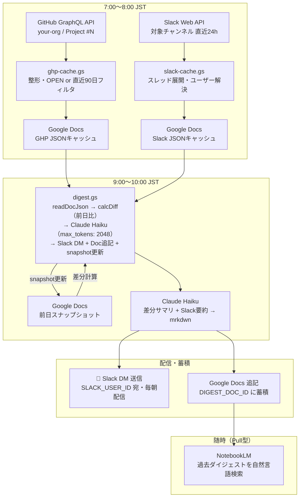

# GHP Daily Digest — GAS セットアップ手順

GitHub Project の動きと Slack チャンネルの会話を毎朝 Claude API でまとめ、
Slack DM に Push 配信しつつ Google Doc に蓄積して NotebookLM で検索できるようにするパイプラインです。

```
7:00〜8:00 JST
  ghp-cache.gs    ──► Google Doc（GHP キャッシュ）
  slack-cache.gs  ──► Google Doc（Slack キャッシュ）

9:00〜10:00 JST
  digest.gs ──► 両 Doc を読む
            ──► スナップショット Doc から前日データ読み込み → 差分計算
            ──► Claude API → Slack DM 送信
            ──► スナップショット Doc に当日データ上書き保存
            ──► 蓄積 Doc に追記（NotebookLM 連携用）
```



---

## ① GAS プロジェクトの作成

| プロジェクト名     | ファイル          |
|--------------------|-------------------|
| `ghp-digest-cache` | `ghp-cache.gs`    |
| `slack-digest-cache` | `slack-cache.gs` |
| `digest`           | `digest.gs`       |

---

## ② 事前に作成する Google Doc（4つ）

| 用途               | 命名例             | 対応プロパティ  |
|--------------------|--------------------|-----------------|
| GHP キャッシュ     | `ghp-cache`        | `GHP_DOC_ID`    |
| Slack キャッシュ   | `slack-cache`      | `SLACK_DOC_ID`  |
| スナップショット   | `digest-snapshot`  | `SNAPSHOT_DOC_ID` |
| 蓄積（任意）       | `digest-archive`   | `DIGEST_DOC_ID` |

各 Doc の ID は URL の `/d/` と `/edit` の間の文字列です。
GAS を実行する Google アカウントに編集権限を付与してください。

---

## ③ スクリプトプロパティの設定

### ghp-digest-cache

| キー                | 値                                        |
|---------------------|-------------------------------------------|
| `GITHUB_TOKEN`      | GitHub PAT（`read:org`, `read:project`）  |
| `GHP_DOC_ID`        | GHP キャッシュ Doc の ID                  |
| `GH_ORG_LOGIN`      | GitHub Organization 名（例: your-org）    |
| `GH_PROJECT_NUMBER` | GitHub Project の番号（例: 42）           |

### slack-digest-cache

| キー                    | 値                                                                          |
|-------------------------|-----------------------------------------------------------------------------|
| `SLACK_BOT_TOKEN`       | Slack Bot Token（`channels:history`, `users:read` スコープ必須）            |
| `SLACK_DOC_ID`          | Slack キャッシュ Doc の ID                                                  |
| `SLACK_CHANNEL_IDS`     | カンマ区切りチャンネル ID（例: `C012AB3CD,C098ZY7WX`）                      |
| `SLACK_CHANNEL_LABELS`  | カンマ区切りラベル（例: `dev-general,dev-backend`）                         |
| `SLACK_WORKSPACE_DOMAIN`| Slack ワークスペースのドメイン（例: `your-org`）                            |

> `users:read` スコープを付与することで、メッセージの `user` フィールドが Slack ユーザー ID から `real_name` に自動解決されます。スコープがない場合はユーザー ID がそのまま出力されます。

### digest

| キー                  | 値                                                        |
|-----------------------|-----------------------------------------------------------|
| `ANTHROPIC_API_KEY`   | Anthropic API キー                                        |
| `SLACK_BOT_TOKEN`     | Slack Bot Token（`chat:write`, `im:write` スコープ必要）  |
| `SLACK_USER_ID`       | 送信先 Slack ユーザー ID（例: `U0123456789`）             |
| `GHP_DOC_ID`          | GHP キャッシュ Doc の ID                                  |
| `SLACK_DOC_ID`        | Slack キャッシュ Doc の ID                                |
| `SNAPSHOT_DOC_ID`     | スナップショット Doc の ID                                |
| `DIGEST_DOC_ID`       | 蓄積 Doc の ID（省略可）                                  |
| `PROJECT_NAME`        | ダイジェストに表示するプロジェクト名（例: `MyProject`）   |
| `SLACK_CHANNEL_LABEL` | ダイジェストに表示するチャンネル名（例: `#dev-general`）  |

> ユーザー名解決は `slack-cache.gs` 側で完結します。`digest.gs` 側での追加設定は不要です。

---

## ④ トリガーの設定

| プロジェクト          | 実行する関数         | 時刻              |
|-----------------------|----------------------|-------------------|
| `ghp-digest-cache`    | `runIfWeekday`       | 午前 7 時〜8 時   |
| `slack-digest-cache`  | `runIfWeekday`       | 午前 7 時〜8 時   |
| `digest`              | `runDigest`          | 午前 9 時〜10 時  |

`runIfWeekday` は土日を自動スキップします。
`runDigest` は毎日実行でも問題ありません（土日は差分なしのダイジェストが届きます）。

---

## ⑤ 初回実行について

スナップショット Doc が空の状態で初回実行すると「初回ベースライン（前日データなし）」と出力され、
差分なしでダイジェストが生成されます。翌日から前日比較が有効になります。

---

## ⑥ NotebookLM との連携

`DIGEST_DOC_ID` を設定しておくと、毎日のダイジェストが Google Doc に蓄積されます。
この Doc を NotebookLM のソースに追加すると、過去のプロジェクト状況を自然言語で検索できます。

> ⚠️ Google Doc は約 100 万文字が上限です。90 万文字を超えると Slack DM で警告が届きます。
> 警告が来たら新しい Doc を作成し `DIGEST_DOC_ID` を更新してください。
